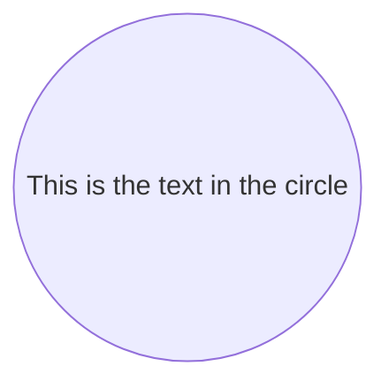
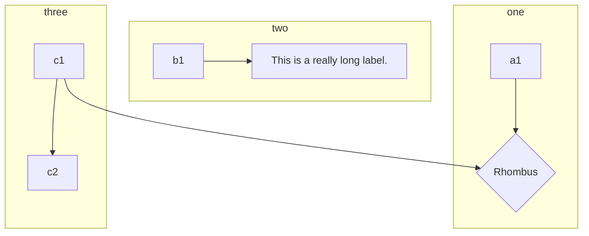

# Home
---

## Welcome to Smartdown

Smartdown is an extension of Markdown that includes several additions:
- The ability to have input, output, and calculation *cells* that react to user input. Smartdown's cells are similar to those in most spreadsheets.
- Additional media embedding support including Tweets, SVG, Video.
- Integration of [P5JS](https://p5js.org)
- Integration of [plotly.js](https://plot.ly/javascript/)
- Much Much more


### Map of functionality

Use the navigation buttons below to explore different aspects of Smartdown.

- [SVG](:@SVG)
- [Math](:@Math)
- [Mermaid](:@Mermaid)
- [Cells](:@Cells)
- [Plotly](:@Plotly)
- [P5](:@P5)

### GIF Example

I'm experimenting with incorporating GIFs for the purpose of building a tutorial.


# SVG
---

Smartdown allows SVG images to be registered and preprocessd so that they can be dynamically styled. For this example, we incorporate an SVG from [Wikimedia Hypercube](https://commons.wikimedia.org/wiki/File:Hypercube.svg).

We can use ordinary Markdown image syntax:


Or, we can use Smartdowns `/media` syntax and amend it with styling:

|hypercube|pulse|clockwise|cclockwise|bluegreen|
|:---:|:---:|:---:|:---:|:---:|
||||||
||||||

---

[Back to Home](:@Home)


# Math
---

#### Math Example

By using MathJax, we can display all sorts of notation.

We can do inline math: $E = mc^2$

$\displaystyle E = mc^2$


Or we can do block math:

$$
A \longrightarrow B
$$

$$
\begin{array}{c|lcr}
n & \text{Left} & \text{Center} & \text{Right} \\
\hline
1 & 0.24 & 1 & 125 \\
2 & -1 & 189 & -8 \\
3 & -20 & 2000 & 1+10i
\end{array}
$$

And even diagrams via *xyjax*:

$$
\begin{xy}
0;<1em,0em>:
(1,1);p+/v a(18) 5.5em/**@{-},
(1,3);p+/v a(18) 5.5em/**@2{-},
(1,5);p+/v a(18) 5.5em/**@3{-},
(1,9);p+/v a(18) 5.5em/**@{.},
(1,11);p+/v a(18) 5.5em/**@2{.},
(1,13);p+/v a(18) 5.5em/**@3{..},
\end{xy}
$$

---

[Back to Home](:@Home)


# Mermaid
---



---




---

[Back to Home](:@Home)


# Cells
---

### External Data Query

*The Smartdown code below is a work in progress and the syntax used is experimental and in flux.*

One of the goals of Smartdown is to enable simple text files to express rich interactive experiences that involve live data. Ideally, web-based services would already exist to serve the data-hunger of Smartdown. In this example, we are exploring the use of [Wikidata](https://www.wikidata.org) as a data source.

Limitations of the current tech include:

- The [Falcor](https://netflix.github.io/falcor/) syntax is a hack and is not using the Falcor library.
- The current example emphasizes the extraction of thumbnail images from Wikidata and does not display or utilize the full set of metadata returned.

[Who do you want to look up?](:?WHO)

[Lookup Name via slash](:=LOOKUP=/wikidata/Albert Einstein|Albert Ellis|Albert Estopinal)
[Lookup Name via Falcor](:=LOOKUP=/wikidata["Albert Einstein"])
[Lookup Name via WHO variable](:=LOOKUP=/wikidata[`WHO`])
[Lookup result](:!LOOKUP)

---

[Back to Home](:@Home)


# Plotly
---

## Plotly.js Experiments

The current integration of [plotly.js](https://plot.ly/javascript/) is fairly raw, and you may encounter problems with autolayout/sizing as well as other features I haven't tested or fixed.

### Hello World

Here is the [Hello World](https://plot.ly/javascript/getting-started/#hello-world-example) example.

This example enables the user to enter an alternate Title, which is associated with the variable `PLOT_TITLE`. Smartdown's Plotly integration is still in its initial stages, with the plot title being adjustable by changing the `PLOT_TITLE` variable. Eventually, it will be possible to have plots respect arbitrary smartdown variable data, instead of just the special `PLOT_TITLE` variables.

---

[Title](:?PLOT_TITLE)

---

```plotly
var layout = {
    title: 'Default Title',
    autosize: true,
    // width: 500,
    // height: 300,
    margin: {
      t: 100, b: 0, l: 0, r: 0
    }
};

Plotly.plot( this.div, [{
    x: [1, 2, 3, 4, 5],
    y: [1, 2, 4, 8, 16] }], layout,
    {displayModeBar: true} );

```


### 3D Surface Plots

From [3D Surface Plots](https://plot.ly/javascript/3d-surface-plots/)


```plotly

var myDiv = this.div;
Plotly.d3.csv('https://raw.githubusercontent.com/plotly/datasets/master/api_docs/mt_bruno_elevation.csv', function(err, rows){
  function unpack(rows, key) {
    return rows.map(function(row) { return row[key]; });
  }

  var z_data=[ ]
  for(i=0;i<24;i++)
  {
    z_data.push(unpack(rows,i));
  }

  var data = [{
             z: z_data,
             type: 'surface'
          }];

  var layout = {
    title: 'Mt Bruno Elevation',
    autosize: true,
    // width: 500,
    // height: 300,
    margin: {
      t: 100, b: 0, l: 0, r: 0
    }
  };
  Plotly.newPlot(myDiv, data, layout, {displayModeBar: true});
});


```


### Simple Contour Plot

```plotly
var myDiv = this.div;

var size = 100, x = new Array(size), y = new Array(size), z = new Array(size), i, j;

for(var i = 0; i < size; i++) {
  x[i] = y[i] = -2 * Math.PI + 4 * Math.PI * i / size;
    z[i] = new Array(size);
}

for(var i = 0; i < size; i++) {
    for(j = 0; j < size; j++) {
      var r2 = x[i]*x[i] + y[j]*y[j];
      z[i][j] = Math.sin(x[i]) * Math.cos(y[j]) * Math.sin(r2) / Math.log(r2+1);
  }
}

var data = [ {
    z: z,
    x: x,
    y: y,
    type: 'contour'
  }
];

  var layout = {
    title: 'Simple Contour Plot',
    autosize: true,
    // width: 500,
    // height: 300,
    margin: {
      t: 100, b: 0, l: 0, r: 0
    }
  };

Plotly.newPlot(myDiv, data, layout, {displayModeBar: true});
```


### Maps

From [Chloropleth Map](https://plot.ly/javascript/choropleth-maps)


```plotly

var myDiv = this.div;
Plotly.d3.csv(
  'https://raw.githubusercontent.com/plotly/datasets/master/2010_alcohol_consumption_by_country.csv',
  function(err, rows) {
    function unpack(rows, key) {
      return rows.map(function(row) { return row[key]; });
    }

    var data = [{
      type: 'choropleth',
      locationmode: 'country names',
      locations: unpack(rows, 'location'),
      z: unpack(rows, 'alcohol'),
      text: unpack(rows, 'location'),
      autocolorscale: true
    }];

    var layout = {
      autosize: true,
      title: 'Pure alcohol consumption among adults (age 15+) in 2010',
      geo: {
        projection: {
          type: 'robinson'
        }
      }
    };

    Plotly.plot(myDiv, data, layout, {showLink: false, displayModeBar: true});
  });

```

---

[Back to Home](:@Home)


# P5
---

##### Game Jam Experiment using P5JS

[Character Name](:?N)

```p5js/autoplay
// A sound file object
var song;
var spriteX;
var spriteY;
var statusHeight = 30;
var controlHeight = 50;
var trapezoidWidth = 100;
var trapezoidHeight = 200;
var upButton, downButton, leftButton, rightButton, spaceButton;

p5.preload = function () {
  // Load a sound file
  var sound = 'https://gist.githubusercontent.com/DoctorBud/6e90eb9859f2616cd709e41557619172/raw/3dacb7ce9d689a0b71042c567a5d0749ba181870/sound.mp3';
  // song = p5.loadSound(sound);
};

p5.setup = function () {
  // song.loop();  // Loop the sound forever

  p5.createCanvas(p5.windowWidth - 40, 400);
  p5.textSize(20);
  p5.textFont('Helvetica');
  p5.strokeWeight(2);

  function makeButton(label, right, bottom, keyCode) {
    var result = p5.createButton(label);
    result.class('btn-mobile-button');
    result.style('right', right + 'px');
    result.style('bottom', bottom + 'px');
    result.size(25, 25);
    result.mouseClicked(function() {
      p5.handleKey(keyCode);
    });
    return result;
  }

  upButton = makeButton('&uparrow;', 40, 65, p5.UP_ARROW);
  downButton = makeButton('&downarrow;', 40, 5, p5.DOWN_ARROW);
  leftButton = makeButton('&leftarrow;', 70, 35, p5.LEFT_ARROW);
  rightButton = makeButton('&rightarrow;', 10, 35, p5.RIGHT_ARROW);
  spaceButton = makeButton('&infin;', 40, 35, 32);
};

p5.windowResized = function() {
  var w = p5.windowWidth - 40;
  var h = 400;
  p5.resizeCanvas(w, 400);

  if (!spriteX) {
    spriteX = w / 2;
  }
  if (!spriteY) {
    spriteY = h / 2;
  }
  if (spriteX > w) {
    spriteX = w;
  }
  if (spriteY > h) {
    spriteY = h;
  }
};

p5.handleKey = function(key) {
  var delta = 5;
  if (key === p5.LEFT_ARROW) {
    spriteX -= delta;
    if (spriteX < 0) {
      spriteX = 0;
    }
  }
  else if (key === p5.RIGHT_ARROW) {
    spriteX += delta;
    if (spriteX > p5.width) {
      spriteX = p5.width;
    }
  }
  else if (key === p5.UP_ARROW) {
    spriteY -= delta;
    if (spriteY < 0) {
      spriteY = 0;
    }
  }
  else if (key === p5.DOWN_ARROW) {
    spriteY += delta;
    if (spriteY > p5.height) {
      spriteY = p5.height;
    }
  }
  else if (key === 32) {
    spriteX = p5.width / 2;
    spriteY = p5.height / 2;
  }
};

p5.keyPressed = function(e) {
  var validKeys = [
    p5.LEFT_ARROW,
    p5.RIGHT_ARROW,
    p5.UP_ARROW,
    p5.DOWN_ARROW,
    32
  ];

  if (validKeys.indexOf(p5.keyCode) < 0) {
    return true;
  }
  else {
    p5.handleKey(p5.keyCode);
  }
};

p5.draw = function () {
  // if (p5.keyIsPressed) {
  //   p5.keyPressed();
  // }

  p5.background('lightgray');

  var forwardViewWidth = p5.width;
  var forwardViewHeight = p5.height - statusHeight;
  var forwardViewX = 0;
  var forwardViewY = statusHeight;
  var trapezoidX = forwardViewX + forwardViewWidth / 2 - trapezoidWidth / 2;
  var trapezoidY = forwardViewY + forwardViewHeight / 2 - trapezoidHeight / 2;
  p5.fill('lightblue');
  p5.stroke('darkslateblue');
  p5.rect(trapezoidX, trapezoidY, trapezoidWidth, trapezoidHeight);
  p5.fill('lightyellow');
  p5.quad(
    forwardViewX, forwardViewY,
    trapezoidX, trapezoidY,
    trapezoidX, trapezoidY + trapezoidHeight,
    forwardViewX, forwardViewY + forwardViewHeight);
  p5.quad(
    forwardViewX + forwardViewWidth, forwardViewY,
    forwardViewX + trapezoidX + trapezoidWidth, trapezoidY,
    forwardViewX + trapezoidX + trapezoidWidth, trapezoidY + trapezoidHeight,
    forwardViewX + forwardViewWidth, forwardViewY + forwardViewHeight);
  p5.fill('black');
  p5.stroke('black');
  var yDelta = 25;  // FIXME - Trigonometry needed here
  p5.rect(forwardViewX + forwardViewWidth / 6, forwardViewY + yDelta,
          1, forwardViewHeight - 2 * yDelta);
  p5.rect(forwardViewX + 5 * forwardViewWidth / 6, forwardViewY + yDelta,
          1, forwardViewHeight - 2 * yDelta);

  p5.fill('red');
  p5.stroke('darkslateblue');
  p5.ellipse(spriteX, spriteY, 10, 10);

  p5.fill('black');
  p5.rect(0, 0, p5.width, statusHeight);
  var name = env.N || 'Dungeoneer';
  p5.fill('lightgreen');
  p5.stroke('lightgreen');
  p5.text(name, 5, 0.75 * statusHeight);
};

```


---

[Back to Home](:@Home)


